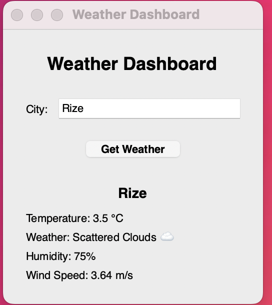

# 🌦️ Weather Dashboard

The **Weather Dashboard** is a Python-based desktop application designed to retrieve and present real-time meteorological data through a graphical user interface (GUI). Developed using the Tkinter framework and integrated with the OpenWeatherMap REST API, the system enables users to query global weather conditions by entering the name of any city. The dashboard subsequently displays key atmospheric information such as temperature, humidity, wind speed, and general weather descriptions enriched with visual emoji indicators.

This project was created as part of an academic assignment for the MIS course. The development process intentionally incorporated **Cursor**, an AI-augmented code editor, to evaluate modern "vibe coding" methodologies and observe how AI-driven tools enhance software development efficiency.

---

## 1. 📌 Project Description

The purpose of this application is to provide a functional and user-friendly weather monitoring tool while demonstrating practical skills in:

- Consuming a public API
- Parsing and handling JSON data
- Building a Tkinter-based GUI
- Managing exceptions and error states
- Integrating AI-assisted development tools

Users enter a city name, after which the application sends a request to the OpenWeather API. The returned data is processed, formatted, and displayed in a structured, readable layout within the GUI. The inclusion of emojis contributes to a more intuitive understanding of general weather conditions.

---

## 2. 📸 Screenshot of the Working Application

Below is a screenshot that demonstrates the interface and functionality of the Weather Dashboard:



The interface is intentionally minimalistic to ensure clarity, ease of use, and accessibility.

---

## 3. ✨ Key Features

The Weather Dashboard includes the following functional components:

- **Real-time Weather Retrieval:** Fetches up-to-date meteorological data for any city worldwide.
- **Temperature Display:** Shows temperature values in Celsius using the metric system.
- **Descriptive Weather Conditions:** Presents textual weather summaries enhanced with emoji representations (e.g., ☀️, 🌧️, ❄️).
- **Humidity and Wind Speed:** Displays auxiliary atmospheric data for a more comprehensive overview.
- **Error Handling:** Detects invalid city names, missing API keys, and connection issues, and notifies the user with appropriate messages.
- **Graphical User Interface:** Provides an accessible and user-friendly layout via Tkinter.
- **Lightweight Implementation:** Requires no database setup and runs locally with minimal configuration.

---

## 4. 🛠️ Technologies Used

The project integrates a range of technologies and libraries, each serving a specific functional purpose:

| Technology             | Purpose                                                                          |
| ---------------------- | -------------------------------------------------------------------------------- |
| **Python 3.x**         | Primary programming language                                                     |
| **Tkinter**            | GUI creation and layout management                                               |
| **Requests**           | Facilitating HTTP communication with the API                                     |
| **OpenWeatherMap API** | Source of real-time weather data                                                 |
| **Cursor IDE**         | AI-assisted development tool used for code generation, refinement, and debugging |

This technological stack demonstrates a combination of traditional programming methods with modern AI-supported practices.

---

## 5. 🤖 Vibe Coding Tool Utilized: Cursor

The development of this application intentionally incorporated **Cursor**, an AI-first integrated development environment (IDE). Cursor supports:

- Natural language code generation
- Context-aware code editing
- Intelligent refactoring suggestions
- Automatic resolution of syntax or logical errors
- Multi-file reasoning across the project

The use of Cursor significantly reduced development time, contributed to cleaner code organization, and facilitated the rapid implementation of GUI-related components and API logic. This project serves as an academic example of how AI-powered tools can enhance contemporary programming workflows.

---

## 6. Installation & Setup Instructions

This section explains how to prepare the Weather Dashboard application on a local machine. These steps ensure that Python, dependencies, and the API key are correctly configured.

### 1. Download or clone the project

- Open your terminal and use git to clone the repository:

```bash
git clone <your-repository-url>
cd weather-dashboard
```

- Install Dependencies

This project uses the requests library to fetch weather data. You must install it via pip:

```bash
pip install requests

```

- Configure API Key

The application requires an OpenWeatherMap API key to function.

Open the weather_dashboard.py file in a text editor.

Locate the line: API_KEY = "YOUR_API_KEY_HERE"

Replace "YOUR_API_KEY_HERE" with your actual OpenWeatherMap API key.

Save the file.

---

## 7. How to Run the Project

This section explains how to launch and use the Weather Dashboard application after completing installation and setup.

- 1. Navigate to the project directory

Open your terminal and move into the project folder:

```bash
cd weather-dashboard
```

- 2. Run the Python application

Use the following command to start the program.

**For Windows:**

```bash
python weather_dashboard.py
```

**For macOS/Linux:**

```bash
python3 weather_dashboard.py
```

- 3. Interact with the application
     Once the program runs, a Tkinter GUI window will appear. You can now:

Type a City Name in the input box.

Click the "Get Weather" button.

View live weather information including:

Temperature (°C)

Humidity (%)

Weather description (with dynamic emoji)

Wind speed

- 4. Error Handling

The application displays friendly warnings if:

The city name is invalid
Your internet connection is down
The OpenWeather API key is missing or incorrect

---

## 8. Credits and Acknowledgments

This section recognizes tools, resources, and contributors involved in creating the project.

- **Developer:** Dalida Ceren Guney
- **Course:** Management Information Systems (MIS) — Vibe Coding Assignment
- **Weather Data Provider:** OpenWeatherMap API
- **Programming Environment:** Python 3, Tkinter GUI toolkit, Requests library
- **AI Development Tool:** Cursor – used for generating, improving, and refactoring code
- **Thanks:**
  - The open-source Python community for documentation
  - The creators of Tkinter and Requests
  - Cursor developers for providing AI-assisted coding features

---
